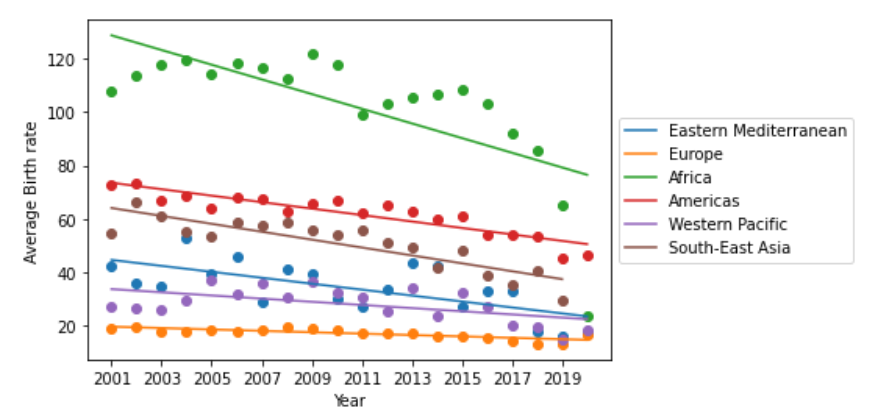
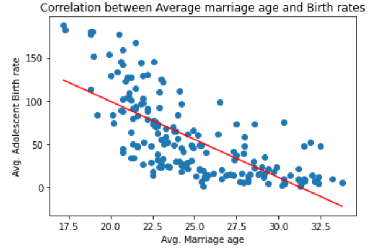

# Analyzing Adolescent Birth Rates around the World:

## Introduction
Adolescent Birth Rate (ABR) is a measure of number of live births among girls of the age group 15-19 years and is calculated per 1000 women, in a definite time period. ABR is an indicator of a social problem as pregnancy in adolescent girls affects their health and future prospects. Besides, it can also contribute to maternal mortalities. According to WHO, pregnancy and childbirth complications are the leading causes of mortality among 15-19 years old girls. Thus, it is important to understand the factors that affect ABR globally.

## Questions/ Problem Statements
To understand the role of social and economic factors that contribute to increasing ABR, the following questions can be asked:
* Which geographical regions in the world have the highest and lowest ABRs?
* Over the years, what has been the trend in ABRs among these geographical regions ?
* Which country has the highest ABR? What has been the trend in its ABR over the years?
* Which country has the lowest ABR? How has it changed over the years?
* Identify the human development indicators that may affect the ABR.
* Identified potential factors:
    * Human Development Index (HDI)
    * Gross National Income per capita
    * Expected years of schooling 
    * Average marriage age 
    * Abortion legality
* What is their respective correlation with ABR? Which developmental indicators have a positive correlation and which ones have a negative correlation?
* Do countries with higher HDI have lower ABRs and vice-versa?
* Does a higher national income lead to lesser adolescent births?
* If expected years of schooling is higher, can it deter early child births?
* What is the correlation between a social indicator like marriage and ABR?
* Is the average marriage age in a country a contributor to its incidences of adolescent child births?
* How can laws affect ABR? For instance, what is the correlation between the legality of abortions and ABR?
* What are the different categories of abortion laws among various countries and what is their distribution?
* Do countries with ABRs above 100 have higher abortion restrictions? How are the different categories of laws distributed among this group?
* On the other hand, how many countries with ABR less than 10 have no abortion restrictions?
* And do all countries with no abortion restrictions have lower birth rates? If yes, what is the range of their ABRs?

## Data Sources
The data used were obtained from the following legitimate sources:
  * the World Health Organization (WHO)- for Adolescent Birth Rates ( : https://apps.who.int/gho/data/node.main.REPADO39?lang=en)
  * the United Nations Development Program (UNDP) - for Human Development Index and other developmental indicators (https://hdr.undp.org/data-center/human-development-index#/indicies/HDI)
  * Our World in Data- for average age of women at marriage ((https://ourworldindata.org/marriages-and-divorces))
  * the World Population Review - for abortion laws (https://worldpopulationreview.com/country-rankings/countries-where-abortion-is-illegal)
After verification, the above data were obtained in either .csv or .json formats.

## Data Cleaning and Integration
  Tool: Python (Pandas)
  
The datasets collected from the different sources were explored for the available fields. Fields that were not relevant to the data analysis were removed. The datasets were also verified for missing values and possible outliers. No outliers were found in the datasets. As for missing values, the datasets didn’t have records for all the countries. So, during data integration phase, the datasets were merged based on the ‘Country’ field, and the records for missing countries were removed. The columns were also renamed as per the requirement of the analysis. 

Adolescent birth rate dataset: the dataset contained birth rate data for age groups between 10-14 and 15-19 years. Only the records within age group of 15-19 were considered for analysis and the remaining records were removed. 

Average marriage age dataset: the data was available from 1970 to present. As per the analysis constraint, data before 2001 were removed. 

## Data Analysis and Visualization
  Tools: Python (Pandas, NumPy, Seaborn, Matplotlib, Tableau)
  
The above tools were used for the analysis of the cleaned data and to arrive at the answers for the aforementioned questions. Pandas library was used to group the data frames and in creating correlation matrices. NumPy was used in creating arrays of specific data for certain analyses. 

In order to visualize the data as plots, Matplotlib and Seaborn libraries were utilized. Seaborn was used mainly to create heatmaps between parameters that have correlation. For the overall analysis of the factors, the Tableau software was used for data visualization.

## Results
### Geographical regions in the world which have the highest and lowest ABRs:
  There are 6 regions in the data that the countries are grouped under. They are:
  1. Eastern Mediterranean
  2. Europe
  3. Africa
  4. Americas
  5. Western Pacific
  6. South-East Asia
  * Africa has the highest Adolescent Birth Rate and Western Pacific has the lowest Adolescent Birth Rate.
  * Overall, Europe has lower ABRs than other regions.

### The trend of ABRs among the geographical regions:
   
   
   
  * All the regions have a decreasing trend in their ABRs over the period of 20 years.
  * The highest decrease in ABR is seen in Africa. 
  * Europe has a low but stable ABR over the years.

#### Country with the highest ABR and its trend over the years
  Niger had the highest birth rate in 2007 and the highest average ABR of 187. 
  
 
          
  Over the years, there seems to be a declining trend in the ABR of Niger.

#### Country with the lowest ABR and its trend over the years
  Republic of Korea i.e. South Korea has the lowest ABR among the considered countries.
  
 
          
  The adolescent birth rates of Republic of Korea has fluctuated. But ultimately, there has been a decreasing trend over 20 years.

### Developmental indicators and their correlation with ABR
  * The developmental indicators considered are: Expected years of schooling, Gross National Income per capita, Human Development Index (HDI) and HDI rank.
  *  Correlation of other indicators with Human Development Index (HDI):
Human Development Index (HDI)                                 1.000000   
Expected years of schooling                                   0.903962   
Gross national income (GNI) per capita                        0.813569   
HDI rank                                                     -0.990271   
Avg. Birth rate                                              -0.814447   

 
           
   Negative correlation: With the increase in HDI, the average adolescent birth rates seem to decrease. Hence, countries with higher HDI are likely to have lower adolescent birth rates.
   
  #### Correlation between HDI rank and average ABR:   

 
            
   Positive Correlation: Lower HDI ranks have higher numerical values and vice-versa. The countries with top ranks i.e. lower numerical values have lower adolescent birth rates. Similarly, the countries with lowest ranks (higher numerical values) have higher adolescent birth rates.
   
  #### Correlation between expected years of schooling and average adolescent birth rate:

                    
   Negative correlation: Indicates that with the increase in expected years of schooling, the average adolescent birth rate for a country tends to decrease.
   
  #### Correlation between gross national income (GNI) and average ABR:
  
 

   Negative correlation: Higher the per capita Gross National Income for a country, the lower is its adolescent birth rate.
   
   
### Correlation between a social indicator like marriage and average ABR
  * The average marriage ages of different countries were considered. The maximum and minimum average marriage ages were 33 and 17, respectively. 
  * The mean age of marriage is 24. There seems to be no country with an average marriage age less than 16, indicating that child marriages are not the norm anywhere.

 
           
   Negative correlation: The higher the average marriage age in a country, the lower is its average adolescent birth rate. Indicates that as people tend to marry later, adolescent births are low in a country.
   
   
### Effect of abortion laws on average ABR: 
  * The categories of abortion laws considered are:
    Legality                                                           Number of countries
No restriction                                 56
Prohibited altogether                          25
To preserve health/on socioeconomic grounds    13
To preserve physical health                    36
To preserve physical/mental health             23
To save a woman's life                         37
Varies by state                                 1
    * More than one-fourth of the countries have no restrictions on abortion.
    * Majority of the countries have condition-based abortions: based on physical/mental health and/or socio-economic grounds.
    * 25 out of 191 countries have banned abortion altogether.
  * There are 31 countries with birth rate above 100 that have restrictions in their abortion laws and their distribution is below:

          
  * The countries with ABR above 100 contribute to 23% of the countries with abortion restrictions.
  * There are 17 countries with birth rate under 10 that have no restrictions in their abortion laws.
  * Do all countries with no abortion restrictions have a lower birth rate? 91% of the countries with no abortion restrictions have adolescent birth rates less than 50. Hence, the countries with no abortion restrictions have birth rates less than 100. 

### Comparison between Avg. marriage age and adolescent birth rate (based on Abortion legality)

  * Countries with no abortion restrictions and higher average marriage ages seem to have a lower ABR.
  * On the other hand, countries that prohibit abortion altogether can be seen having a higher ABR despite having a comparable average marriage age.

## Conclusion
In this project, the Adolescent Birth Rates of different regions have been compared and their trends have been noted. And the ABR trends of the countries with the highest and lowest ABRs have been visualized. Further, the correlation between potential factors and ABR were calculated and plotted. 
From the analysis, it is evident that all the considered developmental, social and legal factors have a correlation with the adolescent birth rates of countries. Depending on their positive or negative correlation, they can be varied to have an effect on the ABR. Thus, it can be understood that if those factors are acted upon, then the birth rates in adolescents can be reduced gradually. 
